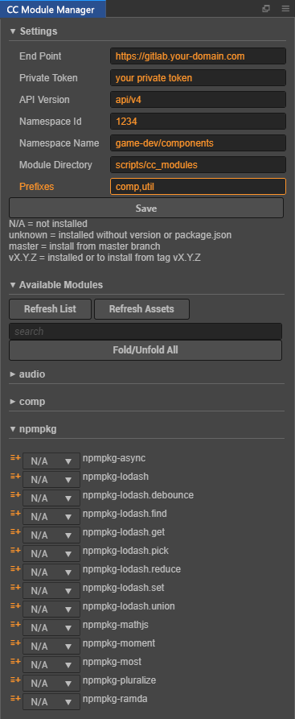

# A Cocos Creator Module Manager Panel

## Installation

```bash
cd ~/.CocosCreator/packages
git clone https://github.com/aztack/cc-modules.git
cd cc-modules
npm i
```

## Setup

Open `CC Module Manager` by click 'Main Menu/Extension/CC Module Manager'

Setup mandatory confgiurations.

- `End Point` : Your private gitlab domain (with protocol and without trailing slash)
- `Private Token`: Your private token. see [Gitlab: Personal access tokens](https://docs.gitlab.com/ee/user/profile/personal_access_tokens.html)
- `API Version`: Currently only support `api/v4`. Do not change
- `Namespace Name`: Namespace name where your modules located
- `Namespace Id`: Namespace id where your modules located.
- `Module Directory`: Directory where your modules will be downloaded
- `Prefixes`: Only repository name started with given prefixes will be considered as modules


## Screenshot



## Conventions

1. All your modules MUST be located in ONE namespace
2. All your modules MUST be started with meaningful prefixes (`comp-` for component and `util` for utilities). If you need to support more prefixes, set `Prefixes` like `comp,util,image,audio`
3. All your modules MUST contains a `package.json` which is generated with `npm init` and contains a `version` field as current version.
4. All your module repositories MUST be tagged with semantic version like `v1.0.0` if you want use different versions in different projects.

## Install/Uninstall Modules

- You can install modules by click the `plus` button at the begining of the module list item
- You can uninstall modules by just delete module folder in `Assets Manager`. `Module manager` will refresh the list when deletion is detected.

## Changelog


### v0.0.4

- Load/Save settings to file to avoid losing settings when open more than one Cocos Creator

### v0.0.3

- Group modules with same prefix into sections

### v0.0.2

- Support custom `Prefixes`
- Remove module backup (You have to remove existing module manually)
- Detect existing module version
- Add tag explanation

### v0.0.1

- Basic functionality
